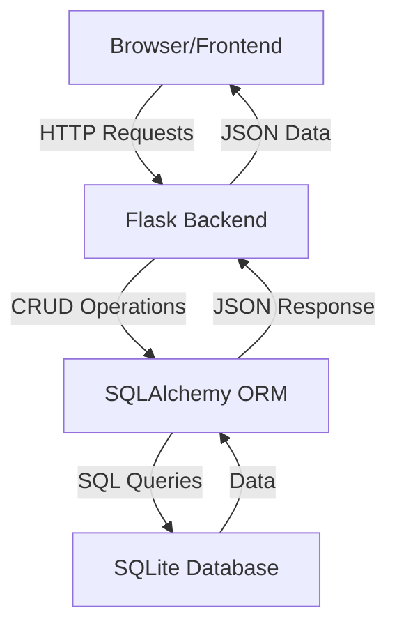

# Todo Application - Project Plan

## Overview
A simple single-user todo application with Flask backend and vanilla JavaScript frontend, using SQLite database for data persistence.

---

## 1. Project Directory Structure

```
todo-app/
├── backend/
│   ├── app.py                 # Main Flask application
│   ├── models.py              # Database models
│   ├── config.py              # Configuration settings
│   ├── requirements.txt       # Python dependencies
│   └── todos.db              # SQLite database (auto-generated)
├── frontend/
│   ├── index.html            # Main HTML file
│   ├── styles.css            # CSS styling
│   └── app.js                # JavaScript logic
└── README.md                 # Setup and usage instructions
```

### Directory Explanation:
- **backend/**: Contains all Flask server-side code
- **frontend/**: Contains all client-side code (HTML, CSS, JS)
- **README.md**: Documentation for setup and running the application

---

## 2. API Endpoints

### Base URL: `http://localhost:5000/api`

| Method | Endpoint | Description | Request Body | Response |
|--------|----------|-------------|--------------|----------|
| GET | `/todos` | Get all todos | None | `[{id, title, description, completed, created_at}]` |
| GET | `/todos/<id>` | Get single todo | None | `{id, title, description, completed, created_at}` |
| POST | `/todos` | Create new todo | `{title, description?}` | `{id, title, description, completed, created_at}` |
| PUT | `/todos/<id>` | Update todo | `{title?, description?, completed?}` | `{id, title, description, completed, created_at}` |
| DELETE | `/todos/<id>` | Delete todo | None | `{message: "Todo deleted"}` |

### API Response Format:
```json
{
  "success": true,
  "data": {...},
  "message": "Operation successful"
}
```

### Error Response Format:
```json
{
  "success": false,
  "error": "Error message",
  "status": 400
}
```

---

## 3. Database Schema

### Table: `todos`

| Column | Type | Constraints | Description |
|--------|------|-------------|-------------|
| id | INTEGER | PRIMARY KEY, AUTOINCREMENT | Unique identifier |
| title | VARCHAR(200) | NOT NULL | Todo title |
| description | TEXT | NULLABLE | Optional description |
| completed | BOOLEAN | DEFAULT FALSE | Completion status |
| created_at | DATETIME | DEFAULT CURRENT_TIMESTAMP | Creation timestamp |
| updated_at | DATETIME | DEFAULT CURRENT_TIMESTAMP | Last update timestamp |

### SQLAlchemy Model:
```python
class Todo(db.Model):
    id = db.Column(db.Integer, primary_key=True)
    title = db.Column(db.String(200), nullable=False)
    description = db.Column(db.Text, nullable=True)
    completed = db.Column(db.Boolean, default=False)
    created_at = db.Column(db.DateTime, default=datetime.utcnow)
    updated_at = db.Column(db.DateTime, default=datetime.utcnow, onupdate=datetime.utcnow)
```

---

## 4. Technology Stack

### Backend Technologies:
- **Python 3.8+**: Programming language
- **Flask 3.0+**: Lightweight web framework
- **Flask-CORS**: Handle Cross-Origin Resource Sharing
- **Flask-SQLAlchemy**: ORM for database operations
- **SQLite**: Embedded database (no installation required)

### Frontend Technologies:
- **HTML5**: Structure and markup
- **CSS3**: Styling and layout
- **Vanilla JavaScript (ES6+)**: Client-side logic
- **Fetch API**: HTTP requests to backend

### Development Tools:
- **pip**: Python package manager
- **Virtual environment (venv)**: Isolated Python environment
- **VSCode**: Code editor (recommended)

---

## 5. Implementation Architecture



### Data Flow:

1. **Create Todo**:
   - User fills form → JS sends POST request → Flask validates → SQLAlchemy creates record → Returns new todo

2. **Read Todos**:
   - Page loads → JS sends GET request → Flask queries database → Returns all todos → JS renders list

3. **Update Todo**:
   - User clicks edit/complete → JS sends PUT request → Flask updates record → Returns updated todo → JS updates UI

4. **Delete Todo**:
   - User clicks delete → JS sends DELETE request → Flask removes record → Returns success → JS removes from UI

---

## 6. Key Features

### Backend Features:
- RESTful API design
- Input validation and sanitization
- Error handling with appropriate HTTP status codes
- CORS enabled for frontend communication
- Automatic database initialization
- JSON response formatting

### Frontend Features:
- Add new todos with title and optional description
- View all todos in a list
- Mark todos as complete/incomplete
- Edit existing todos
- Delete todos
- Real-time UI updates
- Responsive design
- Error handling and user feedback

---

## 7. Security Considerations

For this simple single-user application:
- Input validation on backend
- SQL injection prevention (via SQLAlchemy ORM)
- CORS configuration for local development
- Basic error handling

**Note**: For production use, consider adding:
- Authentication and authorization
- HTTPS/SSL
- Rate limiting
- Input sanitization
- CSRF protection

---

## 8. Testing Strategy

### Manual Testing Checklist:
- [ ] Create a new todo
- [ ] View all todos
- [ ] Mark todo as complete
- [ ] Edit todo title/description
- [ ] Delete a todo
- [ ] Test with empty title (should fail)
- [ ] Test with very long title
- [ ] Test API endpoints directly (Postman/curl)

---

## 9. Future Enhancements (Optional)

- Add due dates and priorities
- Implement categories/tags
- Add search and filter functionality
- User authentication for multi-user support
- Data export/import (JSON/CSV)
- Dark mode toggle
- Drag-and-drop reordering
- Local storage backup

---

## 10. Setup and Run Instructions

### Backend Setup:
```bash
cd backend
python -m venv venv
venv\Scripts\activate  # Windows
pip install -r requirements.txt
python app.py
```

### Frontend Setup:
```bash
# Simply open frontend/index.html in a browser
# Or use a simple HTTP server:
cd frontend
python -m http.server 8000
```

### Access Application:
- Backend API: http://localhost:5000
- Frontend: http://localhost:8000 (or open index.html directly)

---

## Summary

This plan provides a complete blueprint for building a simple, functional todo application. The architecture is straightforward, using proven technologies that work well together. The SQLite database requires no installation, and the vanilla JavaScript frontend keeps dependencies minimal while providing a responsive user experience.

The implementation follows REST principles, uses proper HTTP methods, and includes error handling. The modular structure makes it easy to extend with additional features in the future.